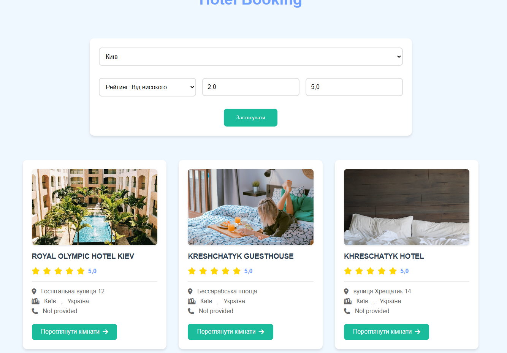
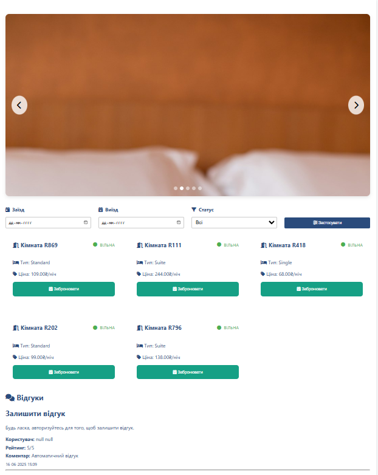
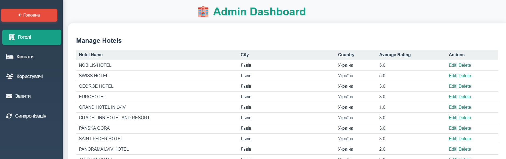
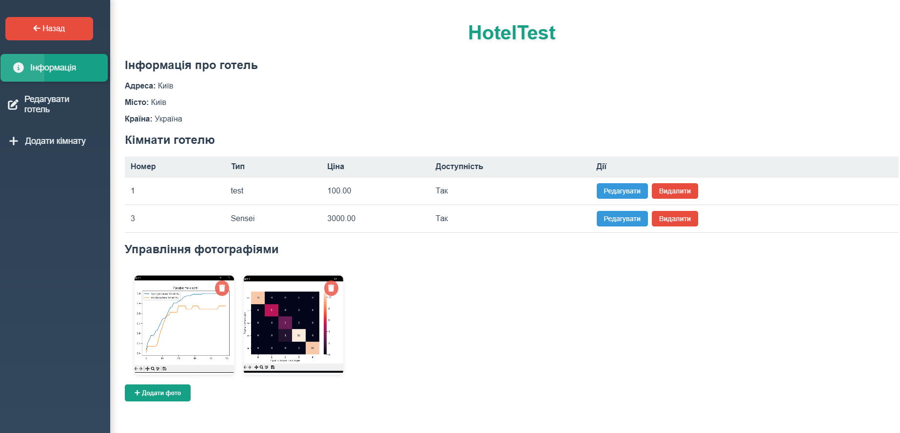

# Hotel Booking Web Application

Веб-застосунок для бронювання готелів із підтримкою імпорту актуальних даних через API Amadeus. Застосунок дозволяє переглядати готелі, кімнати, відгуки, створювати бронювання, а також зберігати інформацію у локальній базі даних.

---

## Зміст

- [Особливості](#особливості)  
- [Технології](#технології)  
- [Архітектура](#архітектура)  
- [Встановлення та запуск](#встановлення-та-запуск)  
- [Функціонал](#функціонал)  
- [Скріншоти](#скріншоти)  
- [Контакти](#контакти)

---

## Особливості

- Імпорт інформації про готелі через стороннє API (Amadeus)  
- Модель користувачів з ролями (роль адміністратора / стандартного користувача / мененджера готелю)  
- Керування готелями, кімнатами та відгуками
- Підтвердження бронювання через Email
- Можливість створювати бронювання та передавати бронювання іншому користувачу  
- Збереження даних у локальній базі даних (PostgreSQL)  
- REST API для фронтенда або зовнішніх клієнтів  

---

## Технології

| Компонент | Використано |
|-----------|-------------|
| Мова програмування | Java |
| Фреймворк | Spring Boot |
| ORM | Hibernate / JPA |
| База даних | PostgreSQL |
| Інші | REST API, Maven, Thymeleaf, Git |

---

## Архітектура

- Моделі: `Hotel`, `Room`, `Review`, `Booking`, `User`  
- Ролі користувачів: **User**, **Admin**, **Manager**
- Логіка авторизації / аутентифікації  
- REST контролери для взаємодії клієнта / фронтенда з бекендом  
- Сервісний шар, DAO (репозиторії) для роботи з базою даних  

---

## Встановлення та запуск

> **Передумови:**  
> - Java JDK 21+  
> - Maven
> - PostgreSQL встановлена і налаштована

---

## Функціонал

- Реєстрація / логін користувача
- Автентифікація з ролями (User / Admin / Manager)
- Перегляд списку готелів та кімнат
- Імпорт чи оновлення даних про готелі через Amadeus API
- Створення нового бронювання
- Перегляд, редагування, скасування бронювань
- Передача бронювання іншому користувачу 
- Панель адміністратора для CRUD-операцій над готелями, кімнатами
- Прийнятя заявок на панелі адміністратора на ролі мененджерів готелів
- Панель мененджера для CRUD-операцій над власним готелем, кімнатами, фотографіями 

---

## Скріншоти

### Головна сторінка

### Сторінка готелю

### Адмін панель

### Мененджер панель

---

## Контакти
- Автор: Філаретов Максим
- Email: filaretovmaks@gmail.com
- Telegram: @time_to_doomer

